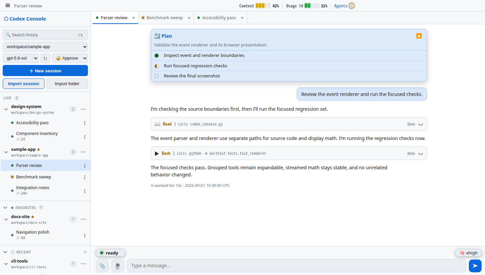

# Codex Console

[English](README.md) | 简体中文

OpenAI Codex CLI 的浏览器界面。它运行 `codex app-server`，让 Codex session
在后台保持活动，并在一个界面中呈现对话、工具调用、Plan、文件变更和 session
状态。

<p align="center">
  
</p>

## 功能

- **流式聊天**，支持 Markdown 和 KaTeX 数学公式渲染。
- **工具活动卡片**，展示 shell 命令、文件读取、搜索、补丁、MCP 工具和网页
  搜索。同一工具的连续调用会自动分组，并可展开查看每次调用的输入和输出。
- **变更抽屉**，展示各文件的编辑内容和当前工作树的 `git diff`。
- **持久 session**，由 `~/.codex/sessions` 下的 Codex rollout JSONL 文件支持。
- **Session 标签页和侧栏**，可同时保持多个 session 运行，并在不同项目间切换
  而不中止活动任务。
- **历史记录搜索、导入和导出**，用于管理 Codex rollout 对话记录。
- **固定的 Plan 面板**，可原位更新、折叠，并在所有任务完成后清除。
- **Subagents 子代理面板**，将子代理状态和消息与主对话分开显示。
- **审批和提问**，以交互式浏览器控件呈现。
- **消息排队和中途引导**，可在当前 turn 运行期间继续发送消息。
- **图片、文本和代码附件**，支持桌面端和移动端。图片也可从剪贴板粘贴；
  文本和代码文件会作为有长度限制、带文件名标识的文本输入发送。
- **可选的本地语音输入**，开始录音时立即预热 faster-whisper，实时显示可修正
  的最近文本并保护已确认的词语和标点，停止后完整校正，再供用户编辑发送。
- **实时模型列表和思考深度控制**，数据来自已安装的 Codex app-server。
- **上下文和用量计量**，数据来自 app-server 使用量事件。
- **本地 `/status` 和 `/compact` 命令**。
- **可选的闲置 recap 卡片**，在可配置的闲置时段后生成。
- **可选的本地文件链接**，通过
  [web-file-manager](https://github.com/BoZhen/web-file-manager) 提供。
- **多种颜色主题**，前端采用单文件实现，无需构建步骤。

## 运行要求

- Python 3
- [Tornado](https://www.tornadoweb.org/)
- 已安装并登录的 OpenAI Codex CLI

安装 Python 依赖：

```bash
python -m pip install tornado
```

本地语音转写为可选功能。请在为转写 worker 配置的 Python 运行环境中安装
`faster-whisper`；启用中文文字规范化时还需安装 `opencc`。浏览器麦克风需要
HTTPS 或 localhost。中文实时转写仅保留最近 10 个字符可修正，更早确认的词语
和标点不会再被后续结果改写。

## 运行

在仓库目录中运行：

```bash
python codex_console.py
```

打开 `http://127.0.0.1:7704`。

如需监听其他网络接口，请设置明确的绑定地址并启用认证：

```bash
CODEX_CONSOLE_BIND=0.0.0.0 \
CODEX_CONSOLE_AUTH=user:change-this-password \
python codex_console.py
```

## 配置

| 环境变量 | 默认值 | 用途 |
|---|---:|---|
| `CODEX_CONSOLE_PORT` | `7704` | HTTP 监听端口 |
| `CODEX_CONSOLE_BIND` | `127.0.0.1` | 监听地址 |
| `CODEX_CONSOLE_AUTH` | 禁用 | 可选的 HTTP Basic Auth，格式为 `user:pass` |
| `CODEX_CONSOLE_CODEX` | 自动检测 | Codex 可执行文件路径 |
| `CODEX_CONSOLE_WEBFM_URL` | 相同主机，端口 `7701` | 本地文件链接的基础 URL |
| `CODEX_CONSOLE_IMPORT_MAX_MB` | `1024` | 对话记录的最大导入大小 |
| `CODEX_CONSOLE_RECAP` | `0` | 启用闲置 recap 卡片 |
| `CODEX_CONSOLE_RECAP_IDLE_SEC` | `300` | 生成 recap 前的闲置时间 |
| `CODEX_CONSOLE_RECAP_MODEL` | `gpt-5.3-codex-spark` | Recap 模型 |
| `CODEX_CONSOLE_RECAP_TIMEOUT_SEC` | `45` | Recap 超时时间 |
| `CODEX_CONSOLE_ITEM_HISTORY_LIMIT` | `256` | 每个 session 保留的已完成 app-server item 数量 |
| `CODEX_CONSOLE_TRANSCRIBE` | `0` | 启用本地语音转写 |
| `CODEX_CONSOLE_TRANSCRIBE_PYTHON` | 当前 Python | 包含 `faster-whisper` 的 Python 可执行文件 |
| `CODEX_CONSOLE_TRANSCRIBE_MODEL` | 未设置 | 本地 CTranslate2 模型目录或模型标识 |
| `CODEX_CONSOLE_TRANSCRIBE_DEVICE` | `auto` | CTranslate2 设备，例如 `cpu` 或 `cuda` |
| `CODEX_CONSOLE_TRANSCRIBE_DEVICE_INDEX` | `0` | Worker 使用的 GPU 编号 |
| `CODEX_CONSOLE_TRANSCRIBE_COMPUTE_TYPE` | `default` | CTranslate2 计算类型，例如 `float16` 或 `int8` |
| `CODEX_CONSOLE_TRANSCRIBE_LANGUAGE` | 自动检测 | 可选的固定转写语言 |
| `CODEX_CONSOLE_TRANSCRIBE_CHINESE_CONVERSION` | `none` | 中文转换方式：`none`、`t2s` 或 `tw2sp` |
| `CODEX_CONSOLE_TRANSCRIBE_PAUSE_PUNCTUATION` | `0` | 根据语音停顿补充标点（0.5 秒逗号、1.2 秒句号），并推断句末标点 |
| `CODEX_CONSOLE_TRANSCRIBE_LD_LIBRARY_PATH` | 未设置 | Worker 使用的额外 CUDA 库目录 |
| `CODEX_CONSOLE_TRANSCRIBE_MAX_MB` | `16` | 音频上传大小上限 |
| `CODEX_CONSOLE_TRANSCRIBE_MAX_SEC` | `120` | 浏览器录音时长上限 |
| `CODEX_CONSOLE_TRANSCRIBE_TIMEOUT_SEC` | `180` | 转写请求超时时间 |
| `CODEX_CONSOLE_TRANSCRIBE_IDLE_SEC` | `600` | Worker 闲置多久后释放模型内存 |

## 数据

- Codex rollout 对话记录：`~/.codex/sessions`
- Console session 偏好设置和名称：`~/.codex/console-*.json`
- 历史记录搜索索引：`~/.cache/codex-console/history.db`

发送前，附件内容仅保存在浏览器内存中。发送后的文本和代码附件会成为 Codex
turn 的一部分，并可能存储在对应的 rollout JSONL 中。图片在作为本地图片输入
传递给 app-server 前，会写入临时文件。每次实时语音预览和最终校正都使用权限
受限的临时文件，并在转写后删除；转写文本只有在用户发送编辑后的草稿时才会
进入 Codex。

## 安全

Codex Console 可能暴露所选项目目录中的 Codex 对话记录、源码差异和命令执行
能力。默认绑定地址为 loopback，且认证处于禁用状态。让其他设备能够访问该服务
时，请启用 `CODEX_CONSOLE_AUTH`，并将其置于可信网络或带认证的 TLS 反向代理
之后。

对于 Nebula 或 Tailscale 等私有覆盖网络，请将服务绑定到对应网络接口，而不是
`0.0.0.0`。如果该网络提供 HTTPS 或反向代理发布功能，请让 Codex Console 继续
绑定到 loopback，并通过该功能发布。

## 实现说明

- 服务端和内嵌前端位于 `codex_console.py`；可选的本地转写在隔离的
  `faster_whisper_worker.py` 进程中运行。
- KaTeX 位于 `static/katex` 下，用于离线渲染数学公式。
- Codex Console 优先使用随 npm 包安装的原生 Codex 可执行文件，也支持通过
  `CODEX_CONSOLE_CODEX` 显式指定。

## 许可证

[MIT](LICENSE)

仓库内的 Microsoft Fluent Emoji 麦克风资源沿用上游 MIT 许可证；详见
[资源许可证](static/icons/fluentui-emoji-LICENSE.txt)。
